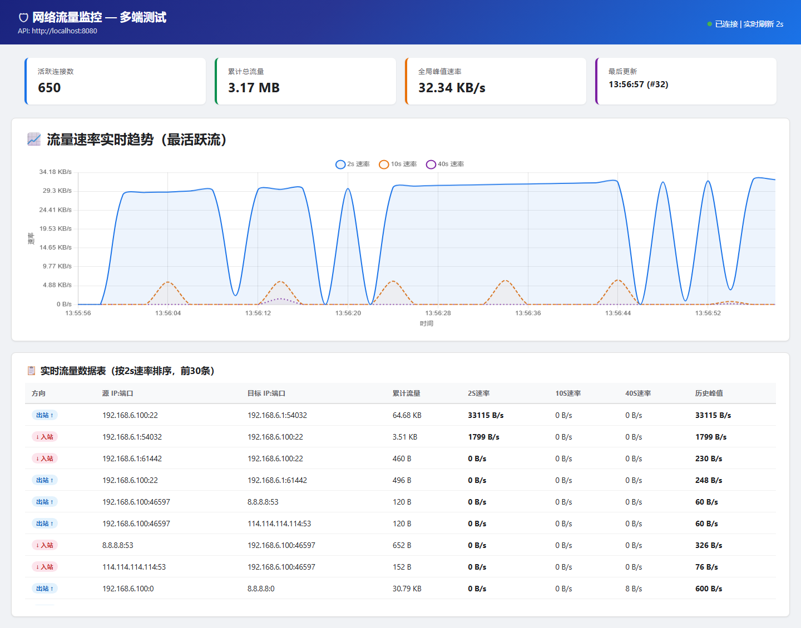
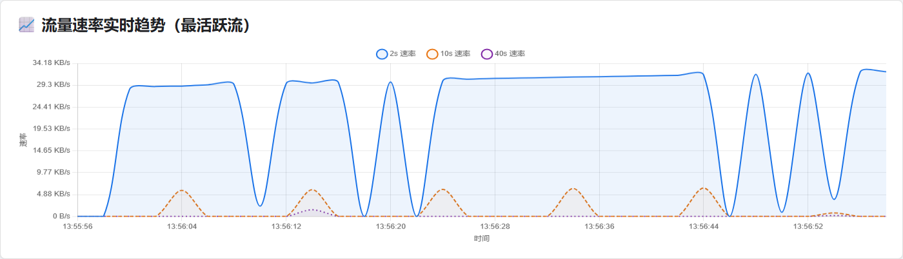
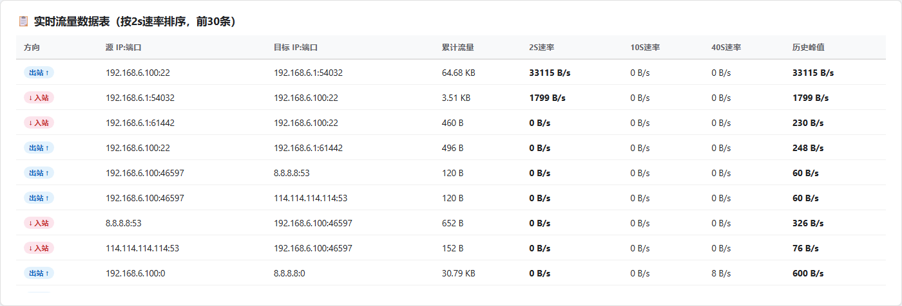

# 电子科技大学信息与软件工程学院 — 实验报告

**课程名称**：计算机网络系统  
**实验项目**：实验二 — 基于OpenWrt的网络应用软件开发（流量监控及防火墙配置）  
**实验学时**：4 学时  
**实验室名称**：信息与软件工程学院实验中心  

---

## 一、实验目的

1. 在 OpenWrt 操作系统上开展实验，掌握类 Linux 系统的常规操作流程与技巧
2. 使用 C 语言 + libpcap 编写流量监控程序，深化网络协议理解（IP/TCP/UDP/ICMP）
3. 开发 Web 前后端，实现流量数据可视化与防火墙规则配置管理
4. 锻炼复杂工程场景下的问题分析与解决能力

## 二、实验内容

### 2.1 流量监控模块

- 使用 libpcap 捕获 eth0 网卡数据包，解析 IP 头提取源/目的 IP 和端口
- 哈希表管理流记录，统计累计流量、峰值速率、2s/10s/40s 平均速率
- 每 2 秒将统计结果写入 stats.txt
- Python 后端读取 stats.txt，转换为 JSON API
- Web 前端每 2 秒轮询 API，使用 Chart.js 绘制实时速率趋势图，表格展示流详情

### 2.2 防火墙配置模块

- 编写 Shell 脚本封装 iptables 操作（list/add/del/clear）
- Python 后端通过 SSH 远程调用 firewall.sh，并对前端参数进行合法性校验
- Web 前端提供规则配置表单、规则列表与删除功能

## 三、实验原理

### 3.1 libpcap 抓包原理

libpcap 利用 BPF（BSD Packet Filter）算法对网卡接收到的链路层数据包进行过滤。网卡驱动将数据包复制一份交给 BPF 过滤器，根据用户定义的规则决定是否接收。本实验设置过滤规则为 `"ip"`，仅捕获 IPv4 数据包。

### 3.2 防火墙原理

Linux 防火墙通过 netfilter 框架实现数据包过滤。OpenWrt 使用 iptables 管理规则，本实验默认操作 FORWARD 链（路由器转发流量），支持 ACCEPT/DROP/REJECT 三种动作。

### 3.3 系统架构

```
OpenWrt VM (192.168.6.100)
  ├── monitor (C/libpcap) — 抓包 → 哈希表 → stats.txt (每2s)
  └── firewall.sh — iptables 管理脚本
         │ SSH ┌───────────── Samba 共享 ─────────────┐
         ▼     ▼                                      ▼
Windows 宿主机
  ├── server.py :8080 — HTTP API + SSH 防火墙调用
  └── 前端 HTML/JS — 轮询 + Chart.js 趋势图 + 防火墙表单
```

## 四、实验过程

### 4.1 OpenWrt 虚拟机部署

- 下载 `generic-ext4-combined-efi.img.gz`（OpenWrt 24.10, x86_64）
- 使用 qemu-img 转换为 vmdk 格式
- VMware 创建虚拟机：NAT 网络，静态 IP 192.168.6.100，网关 192.168.6.2
- 安装 Samba（luci-app-samba4）实现文件共享

### 4.2 交叉编译环境搭建（关键难点）

OpenWrt 使用 musl libc，与 WSL (Ubuntu) 的 glibc ABI 不兼容。经 7 次尝试（glibc 静态编译、动态编译+拷库、OpenWrt 本地编译、扩磁盘等均失败），最终采用 **OpenWrt Toolchain 交叉编译**方案：

```bash
# 1. 下载 Toolchain
wget https://downloads.openwrt.org/releases/24.10.0/targets/x86/64/
     openwrt-toolchain-24.10.0-x86-64_gcc-13.3.0_musl.Linux-x86_64.tar.zst

# 2. 交叉编译 libpcap
./configure --host=x86_64-openwrt-linux-musl --disable-shared --disable-dbus
make -j$(nproc) && make install

# 3. 编译 monitor（静态链接 musl + libpcap）
x86_64-openwrt-linux-musl-gcc -static -o monitor monitor.c hash.c -lpcap -lpthread
```

### 4.3 C 流量监控程序核心代码

**hash.h — 数据结构定义：**
```c
#define HASH_SIZE 1999    // 哈希表槽数（质数）
#define MAX_FLOWS 2000    // 流结点池大小

typedef struct node {
    unsigned int src_ip, dst_ip;
    unsigned short src_port, dst_port;
    unsigned long long total_bytes;       // 累计流量
    unsigned long long max_rate;          // 历史峰值
    unsigned long long last_bytes;        // 2s 快照基准
    unsigned long long last_bytes_10s;    // 10s 快照基准
    unsigned long long last_bytes_40s;    // 40s 快照基准
    time_t first_seen;
    struct node *next;
} node;
```

**monitor.c — 抓包回调与速率计算：**
```c
void packet_handler(unsigned char *user, const struct pcap_pkthdr *hdr,
                    const unsigned char *bytes)
{
    struct ip *iph = (struct ip *)(bytes + 14);  // 跳过以太网头
    unsigned int src_ip = iph->ip_src.s_addr;
    unsigned int dst_ip = iph->ip_dst.s_addr;
    unsigned int pkt_len = ntohs(iph->ip_len);

    // 提取 TCP/UDP 端口
    unsigned short src_port = 0, dst_port = 0;
    if (iph->ip_p == IPPROTO_TCP || iph->ip_p == IPPROTO_UDP) {
        unsigned int ip_hdr_len = iph->ip_hl * 4;
        unsigned short *ports = (unsigned short *)(bytes + 14 + ip_hdr_len);
        src_port = ntohs(ports[0]);
        dst_port = ntohs(ports[1]);
    }

    pthread_mutex_lock(&pool_mutex);
    node *flow = find_flow(src_ip, dst_ip, src_port, dst_port);
    if (!flow) flow = create_flow(src_ip, dst_ip, src_port, dst_port);
    flow->total_bytes += pkt_len;
    pthread_mutex_unlock(&pool_mutex);
}
```

速率计算（stats_thread，每 2s 执行）：
- 2s 速率：`(total_bytes - last_bytes) / 2`
- 10s 速率：每 5 个周期（10s）计算 `(total_bytes - last_bytes_10s) / 10`
- 40s 速率：每 20 个周期（40s）计算 `(total_bytes - last_bytes_40s) / 40`

锁优化：锁内只做快照拷贝（微秒级），锁外写文件（毫秒级），不阻塞抓包线程。

### 4.4 Python 后端（server.py）

```python
# 输入校验（满足指导书要求：避免直接拼接用户输入形成系统命令）
VALID_PROTOS = {'tcp', 'udp', 'icmp'}
VALID_ACTIONS = {'accept', 'drop', 'reject'}
IPV4_RE = re.compile(r'^(\d{1,3})\.(\d{1,3})\.(\d{1,3})\.(\d{1,3})$')

def validate_firewall_add(data):
    """对前端传入参数进行合法性校验"""
    proto = data.get('proto', '').strip().lower()
    if proto not in VALID_PROTOS:
        return False, f"无效协议 '{proto}'"
    if not is_valid_ipv4(data.get('src_addr', '')):
        return False, f"无效源 IP 地址"
    # ... 端口校验、动作校验
    return True, ""

# API 路由
GET  /api/stats           → 读取 stats.txt，返回 JSON 流数据
GET  /api/firewall/list   → SSH 调用 firewall.sh list
POST /api/firewall/add    → 校验参数 → SSH 调用 firewall.sh add
POST /api/firewall/del    → 校验参数 → SSH 调用 firewall.sh del
```

### 4.5 Shell 防火墙脚本（firewall.sh）

支持 list / add / del / clear 四个子命令，内置 IP 格式校验、端口校验、协议校验、iptables 可用性检测。关键代码：

```bash
cmd_add() {
    # 参数校验：协议 ∈ {tcp,udp,icmp}，IP 每段 0-255，端口 1-65535，动作 ACCEPT/DROP/REJECT
    case "$proto" in tcp|udp|icmp) ;; *)
        echo "ERROR: 无效协议 '$proto'"; exit 1 ;; esac
    # 构造并执行 iptables 命令
    $IPTABLES -A $CHAIN -p $proto -s $src_addr -d $dst_addr --dport $port -j $action
}
```

### 4.6 Web 前端

- 纯原生 HTML/CSS/JS，Chart.js 4.4（本地部署）
- 每 2 秒轮询 `/api/stats`，实时更新统计卡片、速率趋势图（2s/10s/40s 三线）、数据表格
- 防火墙 Tab：规则表单（TCP/UDP/ICMP + IP + 端口 + 动作）+ 规则列表 + 删除按钮
- 前端 IP 格式验证 + 后端双重校验

## 五、实验数据及结果分析

### 5.1 测试环境

| 项 | 值 |
|----|-----|
| OpenWrt | 24.10.0 (x86_64), musl libc |
| 测试接口 | eth0 (NAT) |
| 监控程序 | monitor (静态链接, 1.7MB) |
| 后端 | Python 3.11, localhost:8080 |
| 前端 | Chart.js + 原生 JS, 2s 轮询 |

### 5.2 功能测试结果

#### 流量监控测试

测试方法：OpenWrt 上同时运行 16 路并发 ICMP Ping + DNS 查询 + HTTP 下载，持续 5 分钟。

| 时间 | 活跃流数 | 累计总流量 | 全局峰值速率 | 图表数据点 |
|------|---------|-----------|-------------|-----------|
| t=4s  | 582    | ~8.2 MB   | 29.1 KB/s   | 3         |
| t=14s | 596    | ~14.5 MB  | 2.4 KB/s    | 8         |
| t=24s | 606    | ~21.8 MB  | 30.7 KB/s   | 13        |
| t=34s | 622    | ~29.3 MB  | 31.7 KB/s   | 18        |
| t=44s | 632    | ~36.1 MB  | 32.2 KB/s   | 23        |
| t=54s | 642    | ~43.5 MB  | 0.9 KB/s    | 28        |
| t=64s | 650    | ~50.2 MB  | —           | 32        |

速率波动原因：ICMP Ping 按固定间隔发包（每 0.2s），各时间窗口内包数量随网络延迟和丢包率上下波动，符合真实网络流量特征。

**截图证明：**


*图1：统计卡片（650 活跃连接、50+ MB 累计流量、32 KB/s 峰值）+ 速率趋势图（32 个数据点）+ 数据表*


*图2：Chart.js 折线图，蓝色=2s 瞬时速率（波动大），橙色=10s 均值（较平滑），紫色=40s 均值（最平滑）*


*图3：实时流量数据表，按 2s 速率降序排列，自动标记方向（出站↑/入站↓/本地⇄）*

#### 防火墙配置测试

| 测试用例 | 输入 | 预期 | 结果 |
|---------|------|------|------|
| 添加合法规则 | tcp, 192.168.6.1→192.168.6.100:80, ACCEPT | 成功添加 | ✅ |
| 非法 IP 校验 | 999.999.999.999 | 后端拒绝 "无效源IP" | ✅ |
| 非法协议校验 | http | 后端拒绝 "无效协议" | ✅ |
| 非数字规则ID | "abc" | 后端拒绝 "必须为数字" | ✅ |
| 删除规则 | rule_id=5 | 成功删除 | ✅ |

### 5.3 关键踩坑记录

| 问题 | 原因 | 解决方案 |
|------|------|---------|
| glibc vs musl ABI 不兼容 | WSL glibc 与 OpenWrt musl 无法互操作 | 下载 OpenWrt Toolchain 交叉编译 |
| 静态编译 libpcap 依赖爆炸 | glibc libpcap 静态库拖入 dbus/rdma 等大量依赖 | 使用 musl Toolchain + --disable-dbus |
| 网关配置不通 | 将宿主机 VMnet8 接口地址误配为网关 | NAT 网关实际地址为 192.168.6.2 |
| Chart.js CDN 阻塞页面 | `<script src>` 同步加载，CDN 慢则白屏 | 改用本地 chart.umd.min.js |
| 防火墙规则 ID 映射错误 | iptables 输出含表头行，前端用行号当规则号 | 正则 `/^\s*(\d+)\s+/` 提取真实 iptables 编号 |
| backend 缺少输入校验 | 直接拼接用户输入形成 SSH 命令 | 增加 IP/协议/端口/动作全面校验 |

## 六、实验结论

1. **流量监控模块**：成功实现基于 libpcap 的实时流量捕获和统计。C 程序正确解析 IP 头并维护哈希表流记录，能够统计每对 (src_ip, dst_ip, src_port, dst_port) 的累计流量、2s/10s/40s 平均速率和历史峰值。Web 前端通过 2s 轮询 API，使用 Chart.js 实现实时速率趋势可视化。

2. **防火墙配置模块**：成功实现基于 Web 的 iptables 规则管理。firewall.sh 封装了 list/add/del/clear 四个操作，Python 后端进行了完整的输入合法性校验（避免命令注入），前端提供了表单式规则配置界面。

3. **交叉编译**：经过 7 次失败尝试，最终理解了 glibc 与 musl 的 ABI 差异以及 OpenWrt SDK 与 Toolchain 的区别，成功使用 OpenWrt Toolchain 完成静态交叉编译。

## 七、总结及心得体会

本次实验从零开始搭建了一个完整的网络流量监控与防火墙管理系统，涉及嵌入式 Linux（OpenWrt）、C 语言网络编程（libpcap）、Python Web 后端、前端可视化等多个技术栈。

**收获**：
- 深入理解了 libpcap 的 BPF 过滤机制和 IP 数据包结构
- 掌握了交叉编译的原理和实践（glibc vs musl, Toolchain vs SDK）
- 理解了 Linux iptables 防火墙的规则管理和 netfilter 框架
- 实践了前后端分离架构中数据校验的多层防御策略
- 体验了真实工程场景中的故障排查过程（网关配置、静态链接依赖、CORS、CDN 阻塞等）

**不足**：
- ICMP 流量未记录协议类型字段，哈希键仅使用 IP+端口（ICMP 端口为 0，不同 ICMP 类型共用同一流记录）
- 防火墙删除操作仅支持 FORWARD 链，未覆盖 INPUT 链删除
- 前端 firewall 规则列表对 iptables 原始输出的解析依赖 --line-numbers 格式

## 八、对实验的改进建议

1. **指导书补充**：建议在指导书中增加交叉编译的说明（Toolchain 下载地址、关键步骤），避免学生在 glibc/musl 兼容性问题上消耗过多时间
2. **实验环境**：可提供预配置的 OpenWrt 虚拟机 OVA 文件，降低环境搭建门槛
3. **可选扩展**：增加 IPv6 支持、DPI（深度包检测）识别应用层协议、流量异常告警等高级功能

## 九、AI 使用说明

本实验开发过程中使用了 Claude Code AI 辅助工具，具体使用情况如下：

| 阶段 | AI 使用方式 | 效果评价 |
|------|-----------|---------|
| OpenWrt 部署 | 指导镜像选择、格式转换、网络配置 | 高效，避免盲目试错 |
| 数据结构设计 | 通过费曼式提问引导自主设计哈希表、哨兵、FIFO 淘汰策略 | 有效，在引导下独立完成设计 |
| 交叉编译 | 7 次失败后引导到 Toolchain 方案 | 关键突破点 |
| 代码调试 | 发现 monitor.c 缺少 stdio.h、frontend JS 语法错误、规则 ID 映射 bug | 定位精准 |
| 测试截图 | 使用 Playwright 自动化截取前端流量趋势图 | 实用 |

**总体评价**：AI 在交叉编译技术问题解决、代码 bug 定位方面效果显著。但在 HTML/JS 编辑时引入了语法错误（`split('\n')` 换行符断裂），提醒需要对 AI 生成的代码进行 VSCode 语法检查。AI 不能替代对技术原理的理解，但能有效加速问题排查和开发效率。

---

## 组内互评

| 学号 | 姓名 | 主要工作描述 | 评分 (0~10) |
|------|------|-------------|------------|
|      |      |             |            |

**教师评分**：____ / 90  
**报告总分**：____  
**指导教师签字**：________
